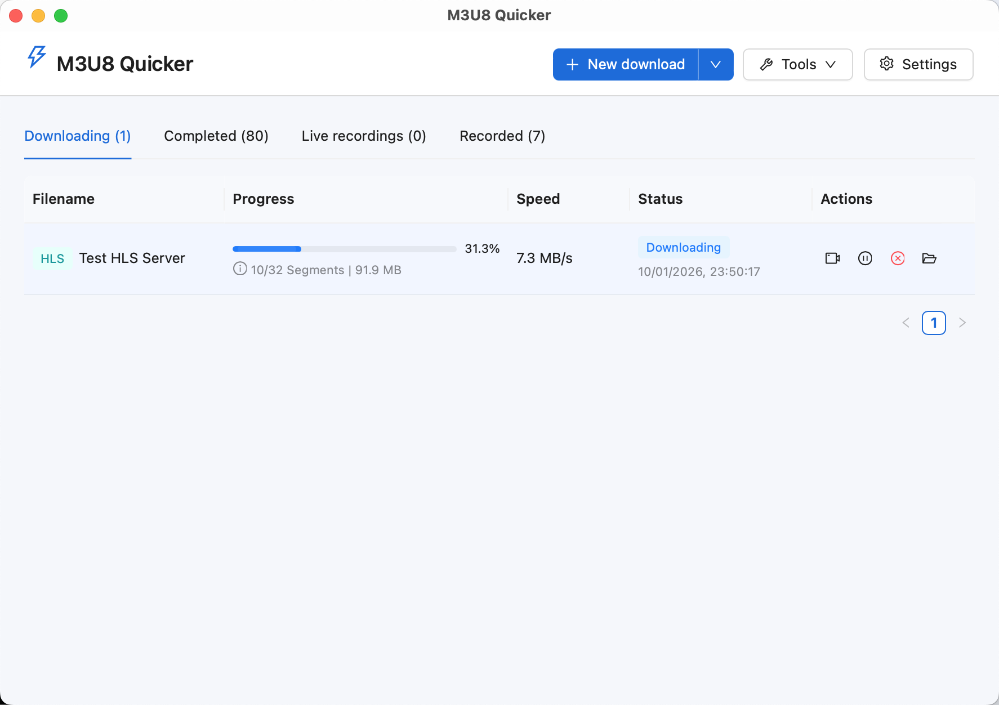
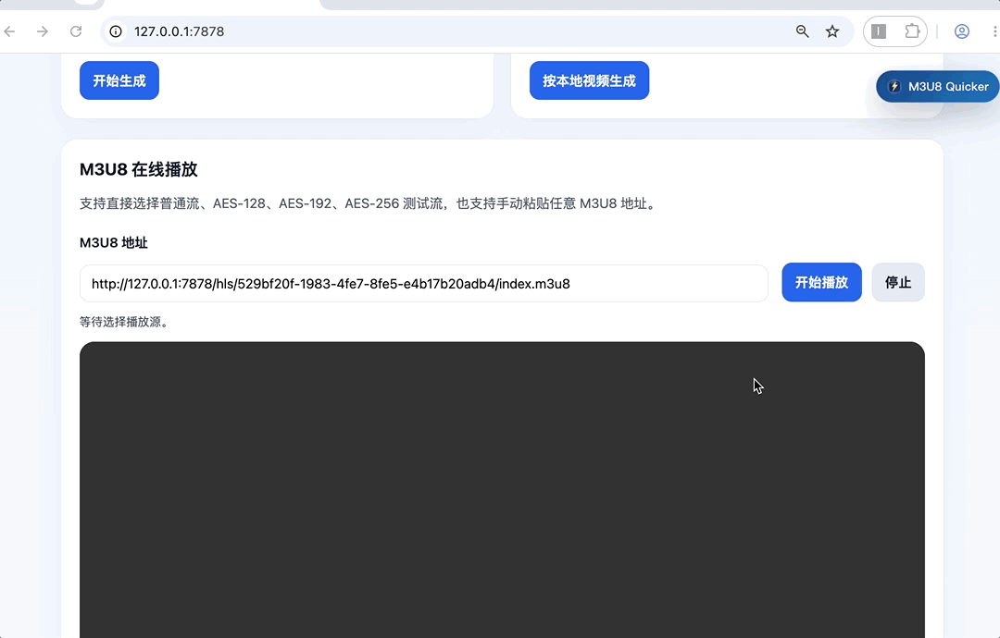
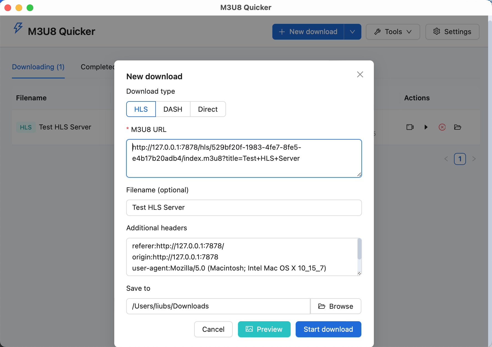
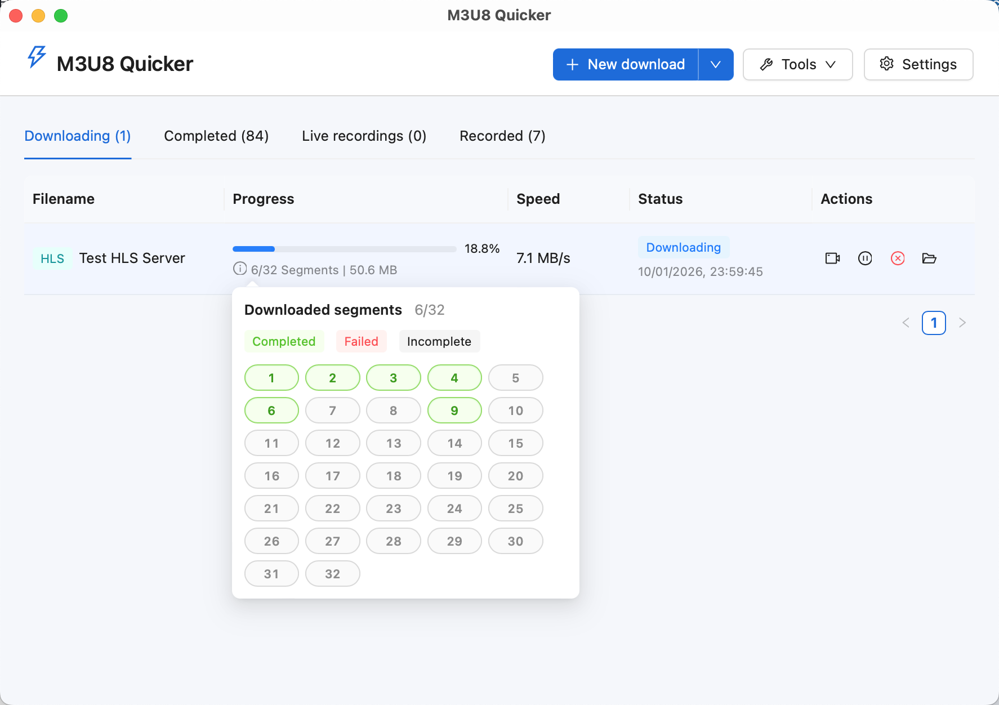

# M3U8 Quicker

[简体中文](./README.md) | **English**

<p align="center">
  
</p>

<p align="center">
  
  
  
</p>
<p align="center">
  <a href="https://github.com/Liubsyy/M3U8Quicker/releases/latest"></a>
  <a href="./LICENSE"></a>
  <a href="https://github.com/Liubsyy/M3U8Quicker/releases"></a>

</p>


**M3U8 Quicker** is a desktop application built with `Tauri + Rust + React + TypeScript` for downloading HLS, DASH, and MP4 videos and recording live streams. It supports Windows, macOS, and Linux.



The application includes an optional **browser extension (Chrome/Firefox/Edge)** that automatically detects videos on web pages and lets you create download or live recording tasks with the required information filled in.



## Features

**Video downloads**

- Download HLS videos (M3U8), with AES-128/AES-192/AES-256 decryption and support for multiple tracks, including separate video, audio, and subtitles.
- Download DASH videos.
- Download regular video files: mp4, mkv, avi, wmv, flv, webm, mov, and rmvb.
- Use concurrent downloads with a configurable concurrency limit.
- Play videos while downloading, pause and resume downloads, and retry failed segments.
- Convert completed downloads to MP4, transcode videos, and convert between formats.
- Configure a proxy.
- Download videos in batches.
- Preview video thumbnails.

**Live recording**

- Record HTTP-FLV and HLS streams.
- Convert completed recordings to MP4.

**Browser extension**

- Automatically detect videos and live streams on web pages.
- Create video download or live recording tasks with one click.
- Support sites such as Bilibili, Douyin, and CCTV in addition to generic video URLs.
- Switch between Chinese and English with “中 / EN”. The extension initially follows the browser language and remembers your manual selection.

## Usage

### Installation

Download the desktop installer or release archive for your system from [GitHub Releases](https://github.com/Liubsyy/M3U8Quicker/releases), or use the direct links below:

| System | Files | Which to choose |
| :--- | :--- | :--- |
|  **Windows** | **x64**: [Installer](https://github.com/Liubsyy/M3U8Quicker/releases/latest/download/M3U8.Quicker_1.2.8_windows_x64_setup.exe) \| [Portable](https://github.com/Liubsyy/M3U8Quicker/releases/latest/download/M3U8.Quicker_1.2.8_windows_x64.zip)<br>**x86**: [Installer](https://github.com/Liubsyy/M3U8Quicker/releases/latest/download/M3U8.Quicker_1.2.8_windows_x86_setup.exe) \| [Portable](https://github.com/Liubsyy/M3U8Quicker/releases/latest/download/M3U8.Quicker_1.2.8_windows_x86.zip) | Choose x64 for most PCs.<br>Choose x86 for 32-bit systems. |
|  **macOS** | **Apple Silicon**: [Installer](https://github.com/Liubsyy/M3U8Quicker/releases/latest/download/M3U8.Quicker_1.2.8_macos_aarch64.dmg) \| [App archive](https://github.com/Liubsyy/M3U8Quicker/releases/latest/download/M3U8.Quicker_1.2.8_macos_aarch64.app.tar.gz)<br>**Intel**: [Installer](https://github.com/Liubsyy/M3U8Quicker/releases/latest/download/M3U8.Quicker_1.2.8_macos_x64.dmg) \| [App archive](https://github.com/Liubsyy/M3U8Quicker/releases/latest/download/M3U8.Quicker_1.2.8_macos_x64.app.tar.gz) | Choose Apple Silicon for M-series chips.<br>Choose Intel for Intel-based Macs. |
|  **Linux** | **Packages**: [deb](https://github.com/Liubsyy/M3U8Quicker/releases/latest/download/M3U8.Quicker_1.2.8_linux_amd64.deb) \| [rpm](https://github.com/Liubsyy/M3U8Quicker/releases/latest/download/M3U8.Quicker_1.2.8_linux_x86_64.rpm)<br>**Portable**: [AppImage](https://github.com/Liubsyy/M3U8Quicker/releases/latest/download/M3U8.Quicker_1.2.8_linux_amd64.AppImage) | Choose deb for Ubuntu, Debian, or Linux Mint.<br>Choose rpm for Fedora, RHEL, CentOS, or openSUSE. |

If macOS displays a message such as “cannot be opened” or “app is damaged” when you first install the application:

1. Open **System Settings → Privacy & Security**, find the blocked application, and click **Open Anyway**.
2. If that does not work, run the following command in Terminal and open the application again:

```bash
xattr -rd com.apple.quarantine /Applications/M3U8\ Quicker.app
```

**Browser extension (optional)**

Open `M3U8 Quicker` → `Tools` → `Install Browser Extension` and follow the instructions for Chrome, Firefox, or Microsoft Edge.

### Create a download

#### Option 1: Use the browser extension (recommended)

After installing the browser extension, it automatically detects video and live stream URLs on web pages. A `M3U8 Quicker` button appears in the upper-right corner. Use it to open the desktop application and create a download or live recording task with `url`, `referer`, `origin`, and `user-agent` filled in automatically.


#### Option 2: Enter a URL manually

Click **New Download** in the main window and enter an `HLS/DASH/MP4` URL to create a task.

If the resource requires additional request headers, enter them in the extra headers field. For example:

```text
referer:http://127.0.0.1:7878/
origin:http://127.0.0.1:7878
user-agent:Mozilla/5.0 (Macintosh; Intel Mac OS X 10_15_7)
```



You can preview video thumbnails before downloading.


### During a download

New tasks appear in the download list. While downloading, you can:

- Pause and resume tasks without starting over.
- Retry only the segments that failed.
- Play videos while they are still downloading.

The download list displays task status, progress, and download speed so you can track each task.



### Playback

You can play videos while they are downloading. If you seek to a segment that has not been downloaded yet, the application prioritizes that segment.


### Settings

The settings panel includes:

- Theme selection.
- Proxy toggle and address.
- Download settings: concurrency, speed limit, and actions after completion.
- Live recording settings.
- FFmpeg download and management.

<br>

## Development and building

### Technology stack

- Frontend: `React 19`, `TypeScript`, `Vite 8`, and `Ant Design 6`.
- Desktop framework: `Tauri 2`.
- Backend logic: `Rust`.

### Requirements

- Node.js: a recent LTS version is recommended.
- Rust: version `1.88` or later.

### Project structure

- `src/`: React frontend and UI logic.
- `src-tauri/`: Tauri desktop application and Rust backend.
- `browser-extension/`: optional browser extension source code, with `chrome/` and `firefox/` subdirectories.
- `test-hls-server/`: a standalone local Rust test server that splits videos into `m3u8 + ts` files.
- `public/`: static assets.

### Local development

#### 1. Install dependencies

```bash
npm install
```

#### 2. Start the desktop application in development mode

Press **F5** in VS Code, or run:

```bash
npm run dev:desktop
```

`npm run dev:desktop` is the cross-platform development entry point, also used by VS Code's F5 launch configuration:

- **Windows / Linux**: equivalent to `npm run tauri dev`.
- **macOS**: starts Vite, builds the development binary, bundles it into an `.app` that declares the `m3u8quicker://` protocol, and registers and launches it. This lets the browser extension open the application during development, as it does on Windows. The bare binary produced by `tauri dev` cannot be registered as a protocol handler on macOS.

### Common commands

| Command | Description |
| --- | --- |
| `npm install` | Install frontend dependencies. |
| `npm run dev` | Start the frontend development server. |
| `npm run dev:desktop` | Start desktop development mode; also register a deep-link `.app` on macOS. |
| `npm run preview` | Preview the frontend build. |
| `npm run tauri dev` | Start desktop development mode without extension deep-link support on macOS. |
| `npm run lint` | Run frontend lint checks. |
| `npm run build` | Run TypeScript checks and build the frontend. |
| `npm run tauri build` | Build desktop application installers. |
| `cargo check --manifest-path src-tauri/Cargo.toml` | Check the Rust / Tauri code. |
| `cargo test --manifest-path src-tauri/Cargo.toml` | Run Rust unit tests. |

### Packaging and resources

- Application name: `M3U8 Quicker`.
- Application identifier: `com.liubsyy.m3u8quicker`.

> Desktop installers bundle the repository's `browser-extension/` directory as an application resource, so the installed application can locate the extension files when guiding users through installation.

> The repository and default packaging configuration do not bundle an `FFmpeg` binary. FFmpeg binaries downloaded through the application or configured by users remain subject to their respective upstream licenses and distribution terms.

## License

- This repository's source code is licensed under Apache License 2.0. See [LICENSE](./LICENSE).
- Any `FFmpeg` used at runtime, including system installations and third-party binaries downloaded through the application, remains subject to its own license. The repository's `Apache-2.0` license does not change those terms.
- See [THIRD_PARTY_NOTICES.md](./THIRD_PARTY_NOTICES.md) for third-party licenses and notices.
